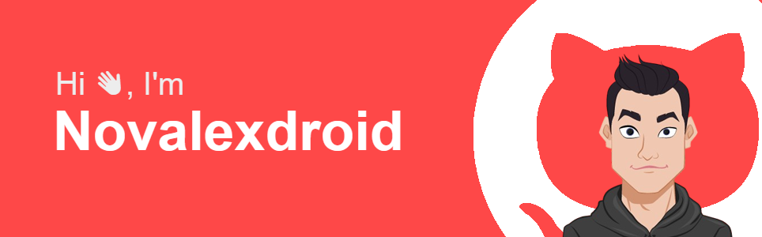

# Hi, I'm Novalexdroid! 

  

### My Skills & Technologies 💻
- **HTML/CSS**: The building blocks of the web.
- **JavaScript**: Making websites interactive and dynamic.

### Projects 🚀

- [Simple screen saver](https://github.com/Novalexdroid/screen-saver)
- [color-contrast-checker(web extension)](https://github.com/Novalexdroid/color-contrast-checker)
- [color-picker(web extension)](https://github.com/Novalexdroid/color-picker)

### What's Next? 🔜
I'm working on improving my front-end and back-end skills. My goal is to become proficient in full-stack development and contribute to open-source projects.

### Let's Connect! 📬
Feel free to reach out if you're interested in collaborating, or if you have any feedback on my projects!

<!-- - [Portfolio](#) -->
 
Thank you for visiting my GitHub! 🙂

